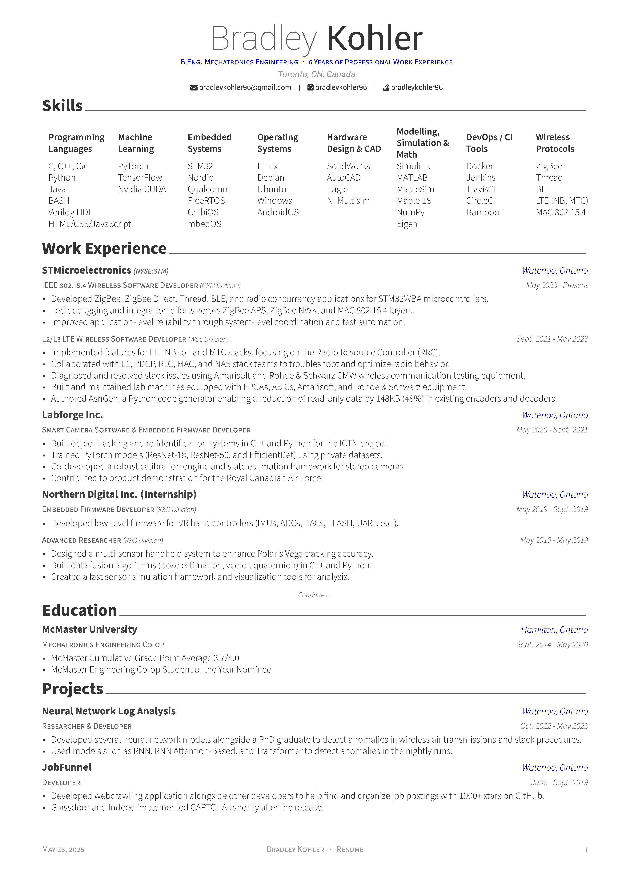
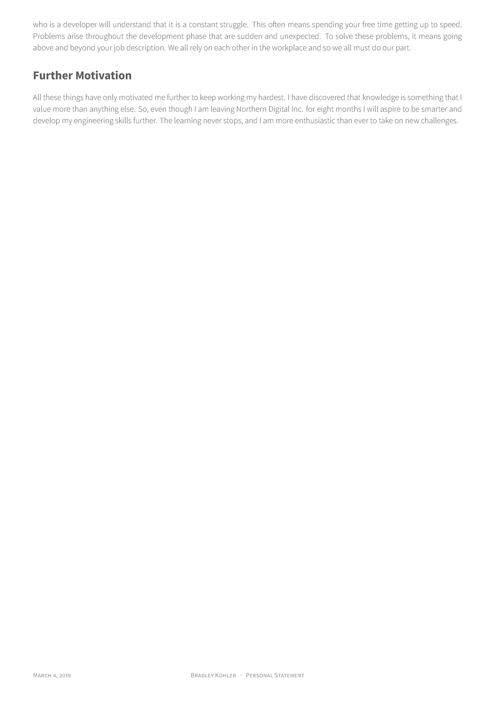

# Hire Me

<br />

## About me

Mechatronics engineer at McMaster University. <br />
Coding is my passion. <br />
I like to solve new, challenging problems. <br />
My programming skills include (but are not limited to): <br />
 - BASH, C/C++, Python, Java and HTML/CSS/Javascript
 - Machine Learning (Pytorch, Tensorflow)
 - Microprocessor Firmware (STM32, Nordic, Qualcomm Simulink)
 - Operating Systems (Linux, AndroidOS, mbedOS, ChibiOS, FreeRTOS)
 - Hardware Design (Verilog HDL, NI Multisim, Eagle)
 - Systems Design (AutoCAD, SolidWorks, Maplesim)
 - Mathematics (Maple18, NumPy, Eigen, MATLAB)

## What is in here?

In this repo you will find my resume, CV, coverletter and other documents that I have written for awards.

## Getting Started

This project depends on the following packages:

 - [GhostScript](https://www.ghostscript.com)

If no ghostscript is installed images won't be regenerated for readme.md.

To build my application simply run
```
make
```

To clean my application simply run
```
make clean
```

## Preview

### Personal Résumé

| Page. 1 |
|:---:|
| [](build/personal_resume.pdf)  |

### Personal Bio

| Page. 1 |
|:---:|
| [](build/personal_bio.pdf) |

### Student Coop Nomination - Personal Statement

| Page. 1 | Page. 2 |
|:---:|:---:|
| [](build/coop_personal_statement.pdf) | [](build/coop_personal_statement.pdf) |

### Student Coop Nomination - Nominee Bio

| Page. 1 |
|:---:|
| [](build/coop_nominee_bio.pdf) |
