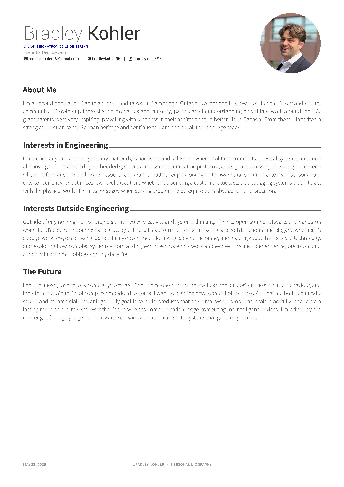

# Hire Me

<br />

## About me

I'm a Toronto-based embedded systems developer with a B.Eng. in Mechatronics Engineering (Co-op) from McMaster University and 6 years of hands-on experience in the field.
I specialize in building low-level firmware, wireless communication stacks (ZigBee, BLE, LTE NB-IoT), and system-level tools that bridge hardware and software.
My focus is on reliable, real-time C/C++ systems that deliver meaningful performance and impact.
I'm passionate about scalable embedded solutions and always looking to contribute to projects that solve real-world problems with elegance and precision.

My skills include (but are not limited to): <br />

**Programming Languages** | **Machine Learning** | **Embedded Systems** | **Operating Systems** | **Hardware Design & CAD** | **Modelling, Simulation & Math** | **DevOps / CI Tools**    | **Wireless Protocols**
--------------------------|----------------------|----------------------|-----------------------|---------------------------|----------------------------------|--------------------------|----------------------------
C, C++, C#                | PyTorch              | STM32                | Linux                 | SolidWorks                | Simulink                         | Docker                   | ZigBee
Python                    | TensorFlow           | Nordic               | Debian                | AutoCAD                   | MATLAB                           | Jenkins                  | Thread
Java                      | Nvidia CUDA          | Qualcomm             | Ubuntu                | Eagle                     | MapleSim                         | TravisCI                 | BLE
BASH                      |                      | FreeRTOS             | Windows               | NI Multisim               | Maple 18                         | CircleCI                 | LTE (NB, MTC)
Verilog HDL               |                      | ChibiOS              | AndroidOS             |                           | NumPy                            | Bamboo                   | MAC 802.15.4
HTML/CSS/JavaScript       |                      | mbedOS               |                       |                           | Eigen                            |                          |

## What is in here?

In this repo you will find my resume, CV, coverletter and other documents that I have written for awards.

## Preview

### Personal Résumé

| Page. 1 |
|:---:|
| [](build/personal_resume.pdf)  |

### Personal Bio

| Page. 1 |
|:---:|
| [](build/personal_bio.pdf) |

## Build My Job Application

This project depends on the following packages:

 - [Latexmk](https://mg.readthedocs.io/latexmk.html)
 - [GhostScript](https://www.ghostscript.com)

If no ghostscript is installed images won't be regenerated for readme.md.

To build my application simply run
```
make
```

To clean my application simply run
```
make clean
```
