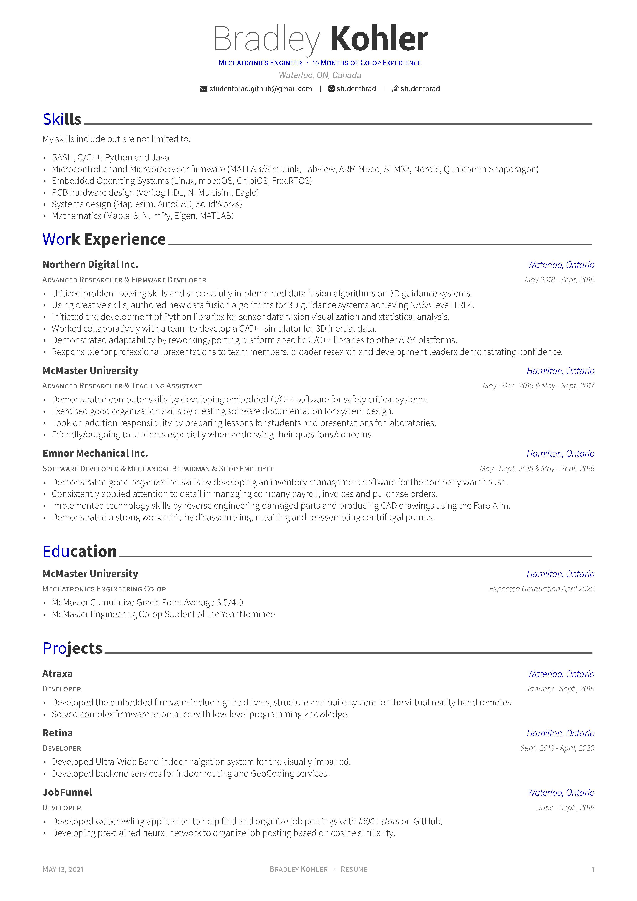

# Hire Me

	

## About me

Mechatronics engineer at McMaster University.  
Coding is my passion.  
I like to solving new, challenging problems.  
My programming skills include (but are not limited to):  
 - BASH, C/C++, Python and Java
 - Microcontroller and Microprocessor firmware (MATLAB/Simulink, Labview, ARM Mbed, STM32, Nordic, Qualcomm Snapdragon)
 - Embedded Operating Systems (Linux, mbedOS, ChibiOS, FreeRTOS)
 - PCB hardware design (Verilog HDL, NI Multisim, Eagle)
 - Systems design (Maplesim, AutoCAD, SolidWorks)
 - Mathematics (Maple18, numpy, Eigen, MATLAB)

## What is in here?

In this repo you will find my resume, CV, coverletter and other documents that I have written for awards.

## Preview

#### Résumé

| Page. 1 | Page. 2 |
|:---:|:---:|
|   |  |

#### Personal Statement Student Coop Nomination

| Page. 1 | Page. 2 |
|:---:|:---:|
|  |  |

#### Student Coop Nominee Bio

| Page. 1 |
|:---:|
|  |
